# Ejercicio 1 – Tareas

## 1. Demuestra con console.log que los 6 niveles se ejecutan en cada clic.

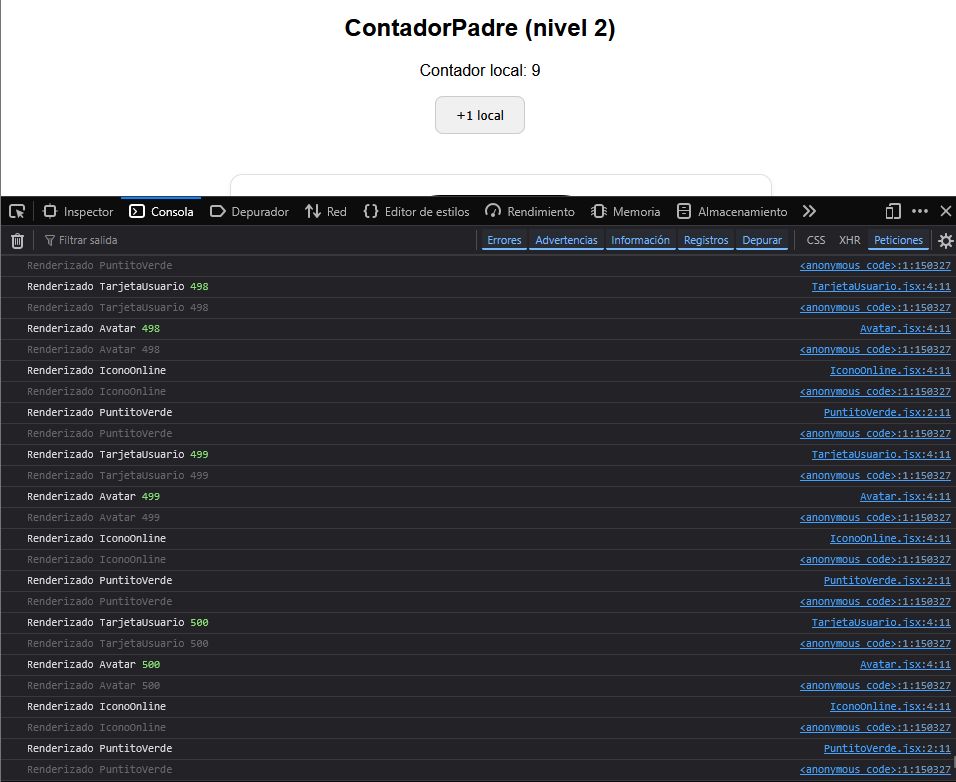

## 2. Abre React DevTools → Profiler → graba 5 clicks.

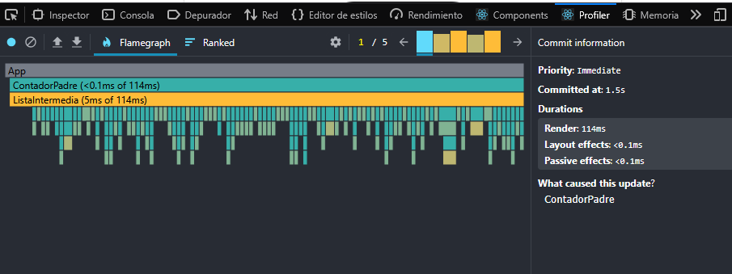
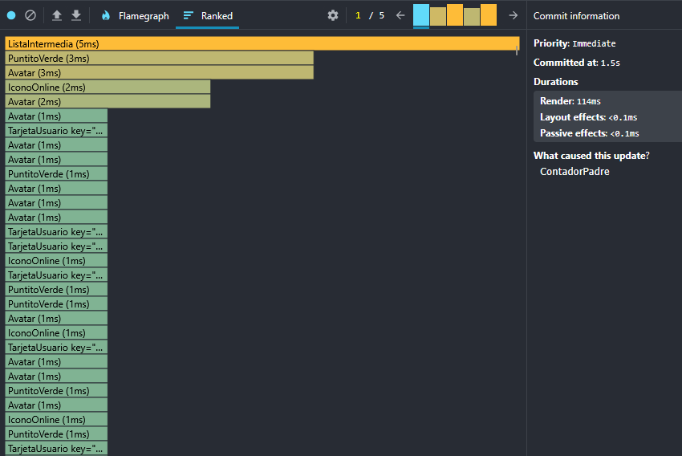

## 3. Muestra capturas de pantalla mostrando los tiempos de renderizado en cada clic.

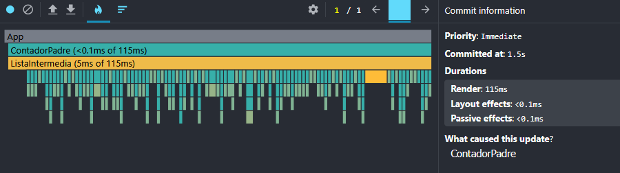

## 4. ¿Se ve lento el navegador? ¿Cuántas funciones (console.log) se ejecutan en cada clic?

- El navegador se nota lento.

- Se ejecutan más de 2000 console.log por cada clic.
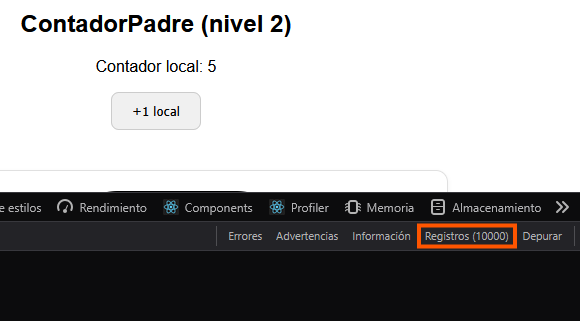 
No todos los renders son necesarios, porque los usuarios no cambian.

## 5. ¿Son todos los renderizados necesarios? ¿Por qué?
No, al ser los mismos usuarios todo el tiempo cargar los usuarios una y otra vaz sobrecarga muchoo el navegador.

## 6. Modificar el programa para evitar los renderizados innecesarios.
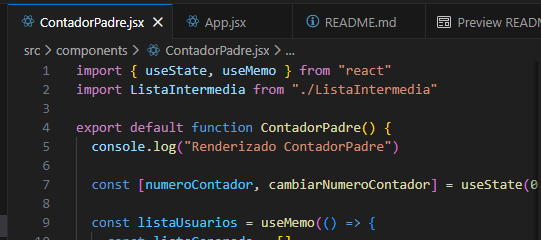

## 7. Vuelve a hacer los apartados 1 a 5.
1.-
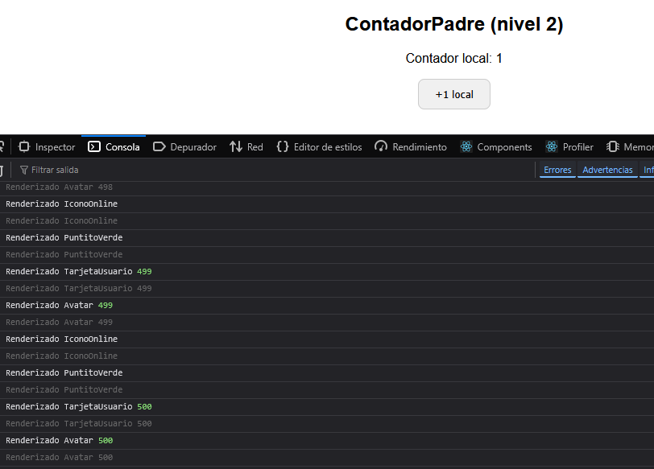
2.-
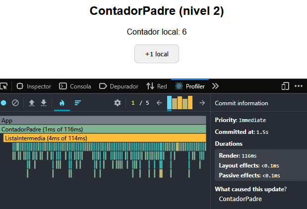
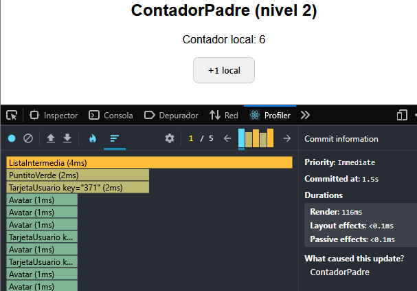

3.-
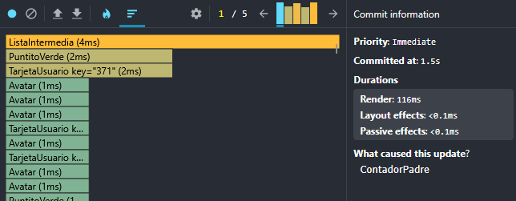
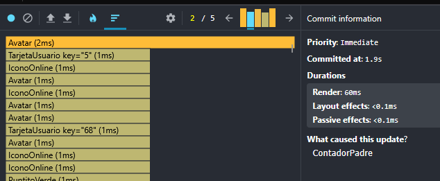

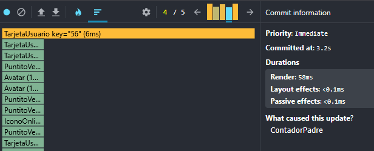
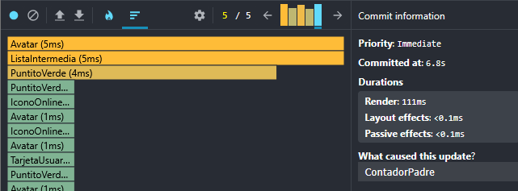
4.-
- El navegador ya no se nota lento.
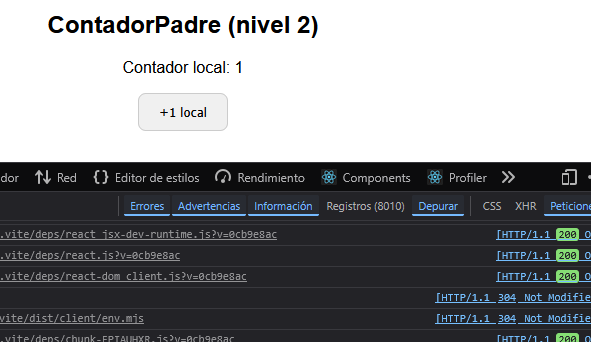

5.-
si, porque ahora estan limitados y ya no carga todo de una vez, lo que alivia la presion sobre el navegador.
---
---
---

# React + Vite

This template provides a minimal setup to get React working in Vite with HMR and some ESLint rules.

Currently, two official plugins are available:

- [@vitejs/plugin-react](https://github.com/vitejs/vite-plugin-react/blob/main/packages/plugin-react) uses [Babel](https://babeljs.io/) (or [oxc](https://oxc.rs) when used in [rolldown-vite](https://vite.dev/guide/rolldown)) for Fast Refresh
- [@vitejs/plugin-react-swc](https://github.com/vitejs/vite-plugin-react/blob/main/packages/plugin-react-swc) uses [SWC](https://swc.rs/) for Fast Refresh

## React Compiler

The React Compiler is currently not compatible with SWC. See [this issue](https://github.com/vitejs/vite-plugin-react/issues/428) for tracking the progress.

## Expanding the ESLint configuration

If you are developing a production application, we recommend using TypeScript with type-aware lint rules enabled. Check out the [TS template](https://github.com/vitejs/vite/tree/main/packages/create-vite/template-react-ts) for information on how to integrate TypeScript and [`typescript-eslint`](https://typescript-eslint.io) in your project.
