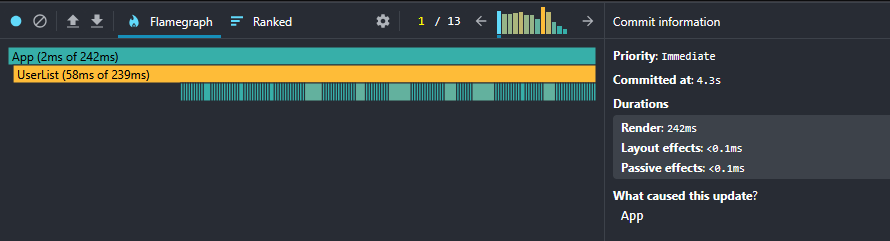
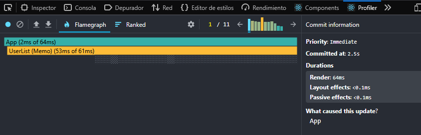

# Ejercicio 2 – Tareas

## 1. Incluye capturas de pantalla de los resultados de Profiles.

### Antes de la optimización


### Después de la optimización



## 2. ¿A mejorado la velocidad de la aplicación? ¿qué cambios y por qué has hecho? Copia el código con ellos README.md

Si ha mejorado la velocidad de la aplicación

Cambios:

useMemo para la lista de usuarios:
Se usó useMemo para crear la lista de usuarios solo una vez al inicio, en lugar de recrearla en cada renderizado. Esto mejora el rendimiento.

useMemo para el filtrado de usuarios:
El filtrado ahora solo se recalcula cuando cambia el texto de búsqueda o la lista de usuarios, en lugar de hacerlo en cada renderizado. Esto optimiza el rendimiento.


codigo optimizado:
```
import { useState, useMemo } from "react"
import SearchInput from "./components/SearchInput"
import UserList from "./components/UserList"

export default function App() {
  const [textoBusqueda, cambiarTextoBusqueda] = useState("")

  // Lista de usuarios solo se calcula una vez gracias a useMemo
  const listaUsuarios = useMemo(() => {
    const lista = []
    for (let numeroActual = 0; numeroActual < 10000; numeroActual++) {
      const usuario = {
        id: numeroActual + 1,
        nombre: "Usuario " + (numeroActual + 1) + " Nombre" + numeroActual,
        correo: "usuario" + (numeroActual + 1) + "@ejemplo.com",
        empresa: "Empresa " + (numeroActual + 1) + " S.A."
      }
      lista.push(usuario)
    }
    return lista
  }, [])

  // Filtro de usuarios optimizado con useMemo para evitar recalcular en cada render
  const listaFiltrada = useMemo(() => {
    const texto = textoBusqueda.toLowerCase() // Convertir texto una vez
    return listaUsuarios.filter(usuario =>
      usuario.nombre.toLowerCase().includes(texto) ||
      usuario.correo.toLowerCase().includes(texto)
    )
  }, [textoBusqueda, listaUsuarios])

  const estiloContenedor = {
    width: "95%",
    maxWidth: "800px",
    margin: "0 auto",
    fontFamily: "sans-serif"
  }

  const estiloTextoPequeno = {
    fontSize: "12px",
    color: "#666",
    marginTop: "5px"
  }

  return (
    <div style={estiloContenedor}>
      <p style={{ fontWeight: "bold" }}>Buscar por nombre o email:</p>

      <SearchInput textoBusqueda={textoBusqueda} cambiarTextoBusqueda={cambiarTextoBusqueda} />

      <p style={estiloTextoPequeno}>Tip: Escribe rápido para ver el lag sin optimizar.</p>

      <p>{listaFiltrada.length} usuarios encontrados</p>

      <UserList usuarios={listaFiltrada} />
    </div>
  )
}
```

---
---
---


# React + Vite

This template provides a minimal setup to get React working in Vite with HMR and some ESLint rules.

Currently, two official plugins are available:

- [@vitejs/plugin-react](https://github.com/vitejs/vite-plugin-react/blob/main/packages/plugin-react) uses [Babel](https://babeljs.io/) (or [oxc](https://oxc.rs) when used in [rolldown-vite](https://vite.dev/guide/rolldown)) for Fast Refresh
- [@vitejs/plugin-react-swc](https://github.com/vitejs/vite-plugin-react/blob/main/packages/plugin-react-swc) uses [SWC](https://swc.rs/) for Fast Refresh

## React Compiler

The React Compiler is currently not compatible with SWC. See [this issue](https://github.com/vitejs/vite-plugin-react/issues/428) for tracking the progress.

## Expanding the ESLint configuration

If you are developing a production application, we recommend using TypeScript with type-aware lint rules enabled. Check out the [TS template](https://github.com/vitejs/vite/tree/main/packages/create-vite/template-react-ts) for information on how to integrate TypeScript and [`typescript-eslint`](https://typescript-eslint.io) in your project.
