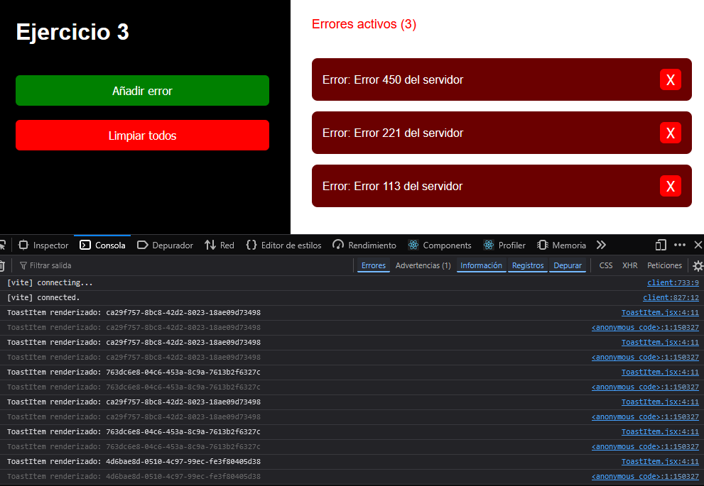
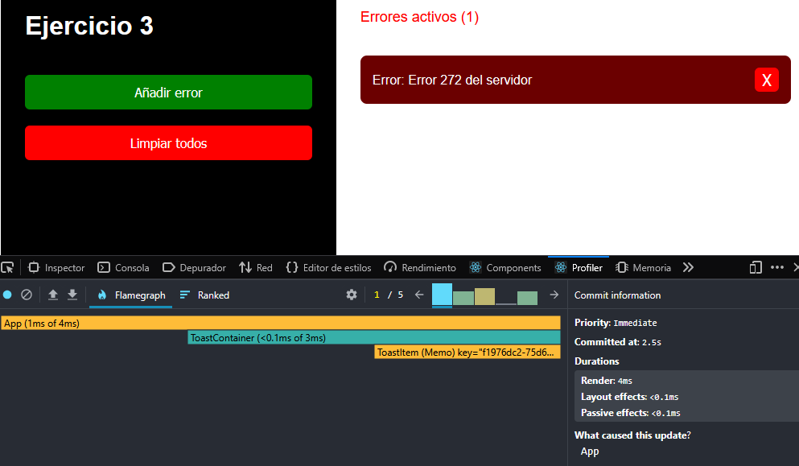
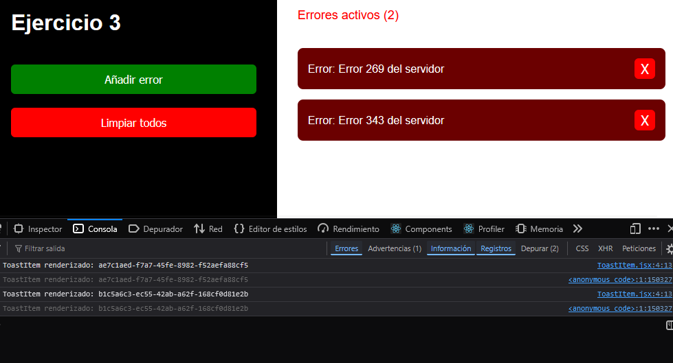
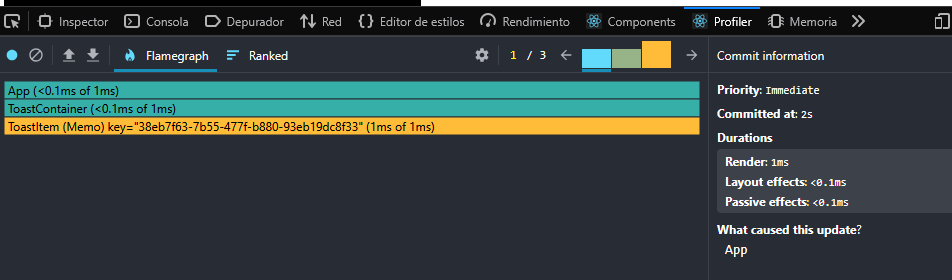

# Ejercicio 2 – Tareas

## 1. Demuestra el problema con console.log dentro de ToastItem.



el porblema es que al hacer cualquier accion,  se vuelven a cargar los errores una y otra vez, se ve porque al hacer una accion, se muestra por consola el console log de los elementos anteriores de la lista de errores

## 2. Mide con Profiler el rendimiento.



## 3. Corrígelo usando useCallback y React.memo() donde corresponda.

Agregamos useCallback a ToastContainer.jsx:
```
import React, { useCallback } from "react";
import ToastItem from "./ToastItem"

function ToastContainer({ listaErrores, borrarErrorPorId }) {
  const estiloContenedor = {
    display: "flex",
    flexDirection: "column",
    gap: "15px"
  }


  const borrarErrorPorIdMemoizado = useCallback(
    (id) => {
      borrarErrorPorId(id);
    },
    [borrarErrorPorId] 
  );

  return <>
      <div style={estiloContenedor}>
        {listaErrores.map((error) => (
          <ToastItem
            key={error.id}
            error={error}
            cerrarError={borrarErrorPorIdMemoizado}
          />
        ))}
      </div>
  </>
}

export default ToastContainer


```



## 4. Mide con Profiler → ahora solo se renderiza el Toast que realmente desaparece.



## 5. En el archivo README.md: Guarda capturas de los dos resultados de Profiler y de las modificaciones que has hecho en el código para corregir el problema (cómo estaba el código antes y cómo después).

sin optimizar:
```
import ToastItem from "./ToastItem"

function ToastContainer({ listaErrores, borrarErrorPorId }) {
  const estiloContenedor = {
    display: "flex",
    flexDirection: "column",
    gap: "15px"
  }

  return <>
    <div style={estiloContenedor}>
      {listaErrores.map(error => (
        <ToastItem
          key={error.id}
          error={error}
          cerrarError={borrarErrorPorId}
        />
      ))}
    </div>
  </>
}

export default ToastContainer

```


Optimizado:
```
import React from "react"

function ToastItem({ error, cerrarError }) {
    console.log("ToastItem renderizado:", error.id);
  const estiloTarjetaError = {
    backgroundColor: "#6b0000",
    color: "white",
    padding: "15px",
    borderRadius: "8px",
    display: "flex",
    justifyContent: "space-between",
    alignItems: "center"
  }

  const estiloBotonCerrar = {
    backgroundColor: "red",
    width: "30px",
    height: "30px",
    borderRadius: "6px",
    border: "none",
    display: "flex",
    alignItems: "center",
    justifyContent: "center",
    color: "white",
    fontSize: "20px",
    cursor: "pointer"
  }

  return <>
    <div style={estiloTarjetaError}>
      <span>Error: {error.mensaje}</span>
      <button
        style={estiloBotonCerrar}
        onClick={() => cerrarError(error.id)}
      >
        X
      </button>
    </div>
  </>
}

export default React.memo(ToastItem)

```


## 6. Explica por qué has hecho esas modificaciones

Explicación de las modificaciones:

    React.memo: Lo usamos para evitar que ToastItem se renderice innecesariamente. Solo se renderiza cuando sus props cambian.

    useCallback: Memorizamos la función cerrarError para evitar que se cree de nuevo en cada renderizado, lo que causaba renderizados innecesarios.

¿Por qué?
    Evitar renderizados innecesarios: Sin estas optimizaciones, todos los ToastItem se renderizaban cuando solo uno cambiaba.

    Mejor rendimiento: Al reducir los renderizados, la app funciona más rápido y es más eficiente.


---
---
---


# React + Vite

This template provides a minimal setup to get React working in Vite with HMR and some ESLint rules.

Currently, two official plugins are available:

- [@vitejs/plugin-react](https://github.com/vitejs/vite-plugin-react/blob/main/packages/plugin-react) uses [Babel](https://babeljs.io/) (or [oxc](https://oxc.rs) when used in [rolldown-vite](https://vite.dev/guide/rolldown)) for Fast Refresh
- [@vitejs/plugin-react-swc](https://github.com/vitejs/vite-plugin-react/blob/main/packages/plugin-react-swc) uses [SWC](https://swc.rs/) for Fast Refresh

## React Compiler

The React Compiler is currently not compatible with SWC. See [this issue](https://github.com/vitejs/vite-plugin-react/issues/428) for tracking the progress.

## Expanding the ESLint configuration

If you are developing a production application, we recommend using TypeScript with type-aware lint rules enabled. Check out the [TS template](https://github.com/vitejs/vite/tree/main/packages/create-vite/template-react-ts) for information on how to integrate TypeScript and [`typescript-eslint`](https://typescript-eslint.io) in your project.
