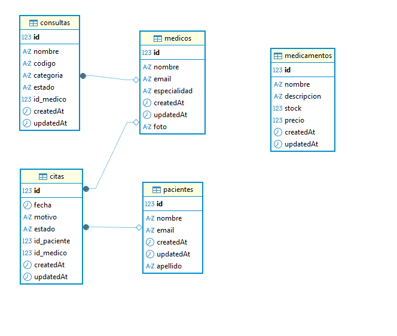
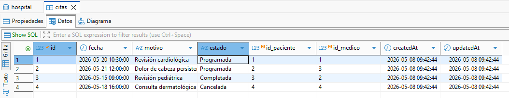
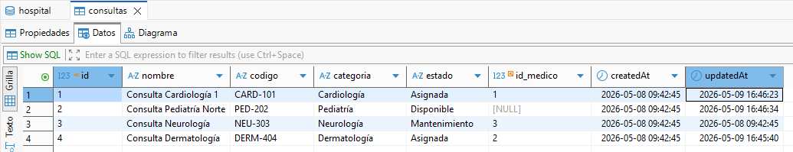
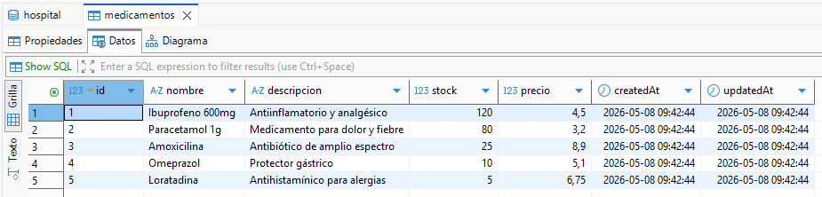
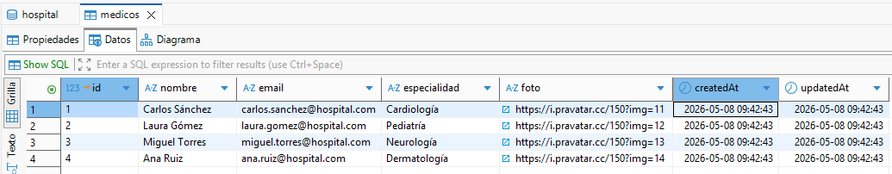
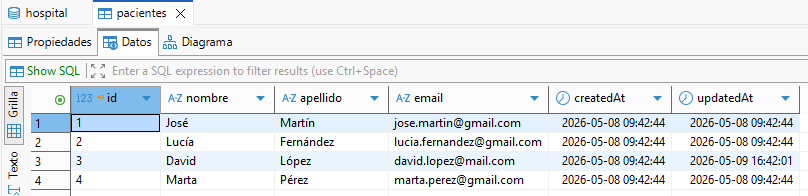
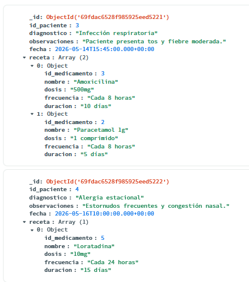

# Hospital App

## Introducción

Hospital App es una aplicación web de gestión hospitalaria desarrollada como proyecto de aprendizaje utilizando Next.js, MySQL y MongoDB.    

El objetivo principal del proyecto ha sido poner en práctica el desarrollo full stack combinando bases de datos relacionales y NoSQL, además de trabajar con validaciones, rutas dinámicas, persistencia de datos y una interfaz sencilla pero funcional.

## Descripción
Aplicación web de gestión hospitalaria desarrollada con:

- Next.js
- React
- MySQL
- MongoDB
- Sequelize
- Mongoose

La aplicación permite gestionar:

- pacientes
- médicos
- citas
- medicamentos
- consultas
- historiales médicos

Incluye persistencia híbrida:

- MySQL para entidades relacionales
- MongoDB para historiales clínicos flexibles

---

# Tecnologías utilizadas

| Tecnología | Uso |
|---|---|
| Next.js | Frontend + Backend |
| React | Interfaz |
| MySQL | Base de datos relacional |
| MongoDB | Base de datos documental |
| Sequelize | ORM MySQL |
| Mongoose | ODM MongoDB |
| CSS | Estilos |


---

# Arquitectura

## Base de datos relacional (MySQL)


---

#  MongoDB
```txt
{
  "_id": "ObjectId",
  "id_paciente": 1,
  "diagnostico": "Gripe",
  "observaciones": "Paciente con fiebre",
  "fecha": "2026-05-14T15:45:00.000+00:00"
  "receta": [
    {
      "id_medicamento": 1,
      "nombre": "Paracetamol",
      "dosis": "500mg",
      "frecuencia": "Cada 8 horas",
      "duracion": "5 días"
    }
  ]
}
```
---

# Capturas de base de datos

## MySQL



### citas



### consultas



### medicamentos



### medicos



### pacientes



---

## Diseño JSON MongoDB

### Colección historial



---

# Funcionalidades principales de la aplicacion

## Gestión de pacientes

- Alta de pacientes
- Edición de pacientes
- Eliminación de pacientes
- Visualización de detalle

## Gestión de médicos

- Alta de médicos
- Edición de médicos
- Eliminación de médicos
- Perfil individual

## Gestión de medicamentos

- CRUD completo
- Control de stock
- Alertas de stock bajo

## Gestión de citas

- Creación de citas
- Asignación médico-paciente
- Estados
- Filtros y búsqueda

## Historial médico

- Persistencia en MongoDB
- Recetas dinámicas
- Relación con pacientes y medicamentos

## Dashboard

- Estadísticas generales
- Medicamentos con stock bajo
- Citas en el mismo dia
- Estado de las consultas
- Próximas citas
- Ultimos historiales

---

# Rutas de la aplicación

| Ruta | Función |
|---|---|
| `/` | Dashboard principal |
| `/pacientes` | Listado de pacientes |
| `/pacientes/[id]` | Detalle de paciente |
| `/pacientes/[id]/editar` | Editar paciente |
| `/medicos` | Gestión de médicos |
| `/medicos/[id]` | Perfil médico |
| `/medicos/[id]/editar` | Editar médico |
| `/citas` | Gestión de citas |
| `/citas/[id]` | Detalle de cita |
| `/citas/nuevo` | Crear cita |
| `/citas/id]/editar` | Crear cita |
| `/medicamentos` | Gestión de medicamentos |
| `/medicamentos/[id]` | Detalle medicamento |
| `/medicamentos/[id]/editar` | Editar medicamento |
| `/historial` | Historial clínico |
| `/historial/nuevo` | Crear historial |
| `/historial/[id]` | Detalle historial |
| `/historial/[id]/editar` | Editar historial |
| `/consultas` | Gestión de consultas |
| `/consultas/[id]/editar` | Editar de consultas |

---

# API REST

## Pacientes

| Método | Ruta | Función |
|---|---|---|
| GET | `/api/pacientes` | Obtener pacientes |
| POST | `/api/pacientes` | Crear paciente |
| PUT | `/api/pacientes/[id]` | Editar paciente |
| DELETE | `/api/pacientes/[id]` | Eliminar paciente |

---

## Médicos

| Método | Ruta | Función |
|---|---|---|
| GET | `/api/medicos` | Obtener médicos |
| POST | `/api/medicos` | Crear médico |
| PUT | `/api/medicos/[id]` | Editar médico |
| DELETE | `/api/medicos/[id]` | Eliminar médico |

---

## Medicamentos

| Método | Ruta | Función |
|---|---|---|
| GET | `/api/medicamentos` | Obtener medicamentos |
| POST | `/api/medicamentos` | Crear medicamento |
| PUT | `/api/medicamentos/[id]` | Editar medicamento |
| DELETE | `/api/medicamentos/[id]` | Eliminar medicamento |

---

## Citas

| Método | Ruta | Función |
|---|---|---|
| GET | `/api/citas` | Obtener citas |
| POST | `/api/citas` | Crear cita |
| PUT | `/api/citas/[id]` | Editar cita |
| DELETE | `/api/citas/[id]` | Eliminar cita |

---

## Historial

| Método | Ruta | Función |
|---|---|---|
| GET | `/api/historial` | Obtener historiales |
| POST | `/api/historial` | Crear historial |
| PUT | `/api/historial/[id]` | Editar historial |
| DELETE | `/api/historial/[id]` | Eliminar historial |

---

## Consultas

| Método | Ruta | Función |
|---|---|---|
| GET | `/api/consultas` | Obtener consultas |
| POST | `/api/consultas` | Crear consulta |
| PUT | `/api/consultas/[id]` | Editar consulta |
| DELETE | `/api/consultas/[id]` | Eliminar consulta |

---

# Validaciones implementadas

- Validación HTML5
- Validación backend
- Validación de email
- Comprobación de campos obligatorios
- Manejo de errores con try/catch
- Confirmación de borrados

---

# Páginas especiales

- `error.js`
- `not-found.js`

---

# Despliegue

## Aplicación desplegada

```txt
https://app-hospital-rose.vercel.app/
```

---

# Repositorio GitHub

```txt
https://github.com/jangelfa26/ICSIA/tree/main/proyecto-final/hospital-app 
```

---
